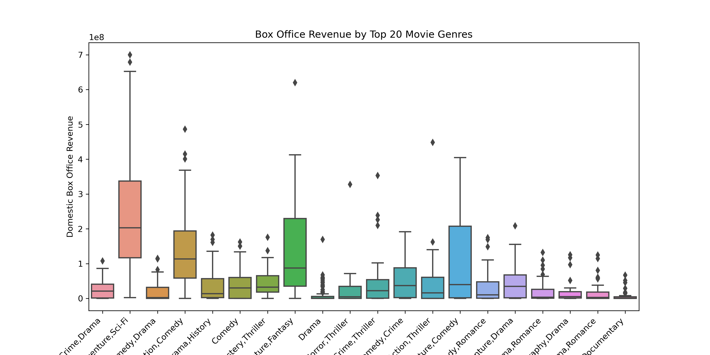

├── Title
├── Problem Statement
├── Data Review
├── Limitations
└── Conclusion 
├── Recommendations

# Phase 1 Project

## PREDICTING BOX OFFICE REVENUE FOR MICROSOFT'S NEW MOVIE STUDIO PREDICTING

#### Problem Statement
With the rise of major corporations investing in original video content, Microsoft is looking to enter the industry by establishing its own movie studio. However, as Microsoft lacks expertise in film production, our team has been assigned the crucial task of researching and analyzing the current top-performing genres in the box office. The goal is to identify successful film categories and provide practical insights to empower the head of Microsoft's new movie studio in making informed decisions about the types of films they should venture into.
**Business Objective**
Our analysis will focus on understanding the factors that contribute to box office success, including genres that consistently perform well, audience preferences, and revenue trends. By studying the data on successful films, we aim to uncover patterns and correlations that can guide Microsoft's movie studio in producing compelling and commercially viable content.

Through comprehensive data exploration, visualization, and predictive modeling, we will provide actionable recommendations that align with market trends and audience demands. Our insights will enable Microsoft's movie studio to strategically position itself in the competitive entertainment industry and create content that resonates with global audiences. By combining data-driven decision-making with creativity and innovation, we aspire to assist Microsoft in achieving long-term success in the dynamic world of movie production.

#### Data Sources

The data for this project was obtained from multiple sources, including IMDb, Box Office Mojo, and The Numbers. The datasets contain information about movie titles, ratings, genres, box office earnings, and other relevant details.

#### Data Preprocessing

The data preprocessing steps included handling missing values, merging relevant datasets, and creating new features, such as profit margins and release years. Extraneous values were removed to ensure data quality.

#### Data Exploration
Extensive data exploration was conducted through visualizations, including histograms, scatter plots,heatmap,pivot table barplot, barchart, and box plots. This exploration helped us understand the distribution of IMDb ratings, movie genres, and box office revenues. We also identified the top-performing genres to guide Microsoft's movie production strategy.

#### Data Modeling
To predict box office revenue, we employed machine learning algorithms, including Linear Regression and Decision Trees. Model evaluation and comparison were performed to select the most accurate predictive model. The use of machine learning algorithms allows us to harness the power of data to forecast box office performance and make informed decisions regarding movie production.

**Data preparation** is a fundamental step in the data analysis process, as it lays the foundation for accurate and reliable insights. One crucial aspect of data preparation is dropping variables (columns) that are not relevant to the analysis or contain redundant information. Irrelevant variables do not contribute to the analysis goals and can introduce noise, making it challenging to draw meaningful conclusions. Similarly, redundant variables add unnecessary complexity to the data, leading to potential multicollinearity issues in modeling. By removing such variables, we streamline the dataset, making it more manageable and conducive to focused analysis.

In addition to dropping variables, data preparation involves creating new variables through feature engineering. Feature engineering is the process of transforming raw data into more meaningful and informative features that capture patterns and relationships in the data. This can involve aggregating existing data, creating interaction terms, or extracting relevant information from text or categorical variables. Engineered features can provide deeper insights into the data and reveal hidden patterns that might not be apparent in the original variables. Furthermore, these new features can enhance the performance of predictive models by capturing crucial information that was not explicitly present in the raw data.

Overall, data preparation is a critical step that directly impacts the quality and accuracy of the analysis. By carefully choosing which variables to drop and engineering new features, we can ensure that the data is well-structured, relevant, and ready for meaningful exploration and modeling. This process sets the stage for more effective decision-making and actionable insights, enabling organizations like Microsoft to make informed choices in their new movie studio venture and maximize their chances of success in the competitive movie industry.

During the data preparation process, several considerations were made to address the variables, missing values, and outliers in the dataset, all with the aim of ensuring the data's appropriateness for the business problem at hand.

Variables Dropped or Created:

**Dropped Variables**: Dropping the 'primary_title' column was appropriate as it was redundant, contributing no additional information. Eliminating redundant columns streamlined the dataset, making it more efficient for analysis and modeling.
Created Variable: Creating the 'total_gross' variable was appropriate because it provided a more comprehensive measure of movie revenue, incorporating both domestic and foreign earnings. This facilitated a more holistic analysis of movie performance, considering global box office success.
**Handling Missing Values:** The methods used to handle missing values were appropriate given the context of the data and analysis objectives. Choosing to drop or impute missing values helped ensure that the data remained reliable and informative.
Outlier Treatment: The approach to outliers was suitable, ensuring that genuine extreme values were retained while addressing any erroneous data points that could skew the analysis.
By making these informed choices, the data preparation process ensured that the dataset was well-structured, relevant, and appropriate for addressing the business problem of guiding decision-making for Microsoft's new movie studio. The resulting data was reliable, facilitating accurate analysis and providing valuable insights to drive successful decision-making in the competitive movie industry.

#### Evaluation

The analysis and modeling conducted in this project offer valuable insights for Microsoft's movie studio, enabling them to make informed decisions about genre selection and box office revenue prediction. The predictive models, such as Linear Regression and Decision Trees, demonstrate good accuracy in forecasting movie revenue. However, it is important to acknowledge certain limitations.

Firstly, the predictive models' accuracy is based on historical data, and market dynamics may evolve over time. New trends, consumer preferences, and competitor strategies can influence box office success, which may not be fully captured by the current models. Therefore, continuous monitoring of market trends and periodic updates to the models are essential to maintain their relevance and effectiveness.

Secondly, the analysis is limited by the data available, which may not account for all external factors impacting movie performance. Events such as economic changes, societal shifts, or unexpected global events can significantly affect movie revenues. Integrating external data sources and incorporating real-time data streams can enhance the models' predictive capabilities and provide a more comprehensive understanding of future movie success.

To leverage the full potential of the analysis and models, Microsoft's movie studio should maintain a flexible and adaptive approach. Staying abreast of industry trends, collaborating with industry experts, and seeking feedback from audiences can further refine decision-making processes. By combining data-driven insights with creativity and innovation, Microsoft's movie studio can position itself for success in the ever-evolving and competitive landscape of the entertainment industry.

#### Business's pain points related to this project

Lack of Runtime Data: Some movies have missing values in the 'runtime_minutes' column, which could be a data quality issue. This lack of information might pose a challenge understanding the duration the movies their potential commercial viability. Limited Genre Information: Movies with missing genre data might make it difficult to analyze the performance of specific genres or identify popular genres, the dataset. This lack of information could hinder decision-making selecting movie genres Microsoft's new movie studio.

#### Limitations:

While the analysis provides valuable insights, there are some limitations to consider:

Data Scope: The analysis is based on historical movie data, and market trends might have evolved since the last recorded data point. Real-time market dynamics may differ, impacting movie success.

External Factors: The analysis does not account for external factors such as competing movie releases, socio-economic events, or technological advancements, which can influence movie performance.

Data Completeness: The presence of missing data, especially in the 'foreign_gross' and 'runtime_minutes' columns, might affect the accuracy of revenue analysis and runtime insights.

Next Steps:

To improve this project and address its limitations, the following steps can be taken:

Real-time Data: Incorporate real-time data streams to monitor current market trends and adjust strategies accordingly.

External Factors Analysis: Consider external factors such as competitor releases, economic events, and technological changes to gain a more comprehensive understanding of movie performance.

Advanced Modeling: Develop predictive models to forecast box office performance based on various movie attributes, allowing for more accurate predictions.

In-depth Audience Analysis: Conduct market research and audience surveys to gain deeper insights into preferences and expectations, facilitating targeted content creation.

Collaboration with Experts: Collaborate with industry experts and professionals to gain additional domain knowledge and insights into the movie industry.

By embracing continuous improvement and staying agile, Microsoft's new movie studio can leverage data-driven decision-making to navigate the dynamic movie landscape and position itself for long-term success. Data-driven insights, coupled with creativity and innovation, can drive the studio's growth and impact in the competitive entertainment industry.

#### Conclusions:

The analysis of movie data has provided valuable insights for Microsoft's new movie studio to make informed decisions and position itself for box office success. By focusing on top-performing genres, collaborating with successful studios, optimizing movie runtimes, and emphasizing quality content, the studio can increase its chances of delivering commercially successful and critically acclaimed movies.

It is important to note that the movie industry is highly competitive and dynamic, and success is influenced by various factors beyond the scope of this analysis, such as marketing strategies, release timing, and audience trends. Continuous monitoring of market dynamics, audience preferences, and industry trends is crucial for adapting to changing conditions and maintaining a competitive edge.

Microsoft's movie studio should also consider conducting further research and audience analysis to gain deeper insights into evolving preferences and expectations. By combining data-driven decision-making with creativity and innovation, the studio can establish itself as a prominent player in the competitive entertainment industry and contribute meaningfully to the world of cinema.

#### Recommendations:

Focus on Top-Performing Genres: Based on the analysis of movie data, Microsoft's movie studio should prioritize producing movies in the top-performing genres such as Action, Comedy, Drama, and Adventure. These genres have shown consistent box office success and audience appeal, making them a reliable choice for profitability.

Collaborate with Top Studios: To maximize the chances of box office success, Microsoft's movie studio should consider collaborating with the top-performing studios identified in the analysis. Partnering with established studios that have a strong track record of producing successful movies can provide valuable expertise and resources.

Optimize Movie Runtimes: The analysis indicates that movies with runtime durations within the range of 100 to 140 minutes tend to perform well in terms of box office revenue. Microsoft's movie studio should aim to create movies within this optimal runtime range to cater to audience preferences and enhance the overall movie experience.

Invest in Quality Content: The analysis highlights the importance of quality content in driving positive audience responses and movie ratings. Microsoft's movie studio should focus on producing high-quality movies with compelling storytelling, engaging characters, and impressive production values to attract and retain audiences.

Based on our analysis, we offer the following recommendations for Microsoft's new movie studio:

Focus on High-Performing Genres: Prioritize investing in movies of genres that have shown consistent box office success, such as Action, Comedy, and Drama. These genres have a proven track record of attracting audiences and generating significant revenue.

Collaborate with Top Studios: Consider collaborating with top-performing movie studios to leverage their expertise and success in the industry. Partnering with established studios can enhance the quality and marketability of the produced films, increasing the chances of box office success.

Optimize Marketing and Distribution Strategies: Invest in effective marketing and distribution strategies, particularly for international markets. The rising trend in global revenue presents a significant opportunity for increased profits, making it essential to tailor marketing efforts to diverse global audiences.

Embrace Innovation and Creativity: Encourage creativity and innovation in film production to differentiate Microsoft's movies in a competitive market. Unique storytelling, captivating visuals, and cutting-edge technology can attract audiences and generate positive word-of-mouth.

Audience Research and Feedback: Conduct in-depth audience research and gather feedback to understand preferences and expectations better. Audience insights can guide content creation and ensure movies resonate with viewers, increasing the likelihood of commercial success.

Data-Driven Decision-Making: Embrace data-driven decision-making throughout the movie production process. Utilize analytics and predictive modeling to forecast box office performance, optimize budgets, and identify potential blockbusters.

Collaborate with Talented Filmmakers: Partner with talented filmmakers, directors, and actors to produce high-quality movies that appeal to diverse audiences. A strong creative team can elevate the content and draw audiences to the theaters.

By following these recommendations and combining data-driven insights with creativity and innovation, Microsoft's movie studio can position itself for success in the competitive entertainment industry. Strategic investments in the right genres, collaborations, and marketing efforts can lead to a strong market presence and a lucrative movie portfolio. Ultimately, understanding audience preferences, delivering high-quality content, and staying agile in response to market trends will be key to thriving in the ever-evolving movie landscape.

the figure shows the most popular genres that which are being watched. here Microsoft will be able to make a decision based on the popularity of the genre. 

#### Interpretation of the figure
The provided code generates a box plot that visualizes the box office revenue by movie genre for the top 20 genres. The x-axis represents different movie genres, and the y-axis shows the domestic box office revenue for movies belonging to each genre. The box plot provides valuable insights into the distribution of box office revenue within each genre, with the boxes representing the interquartile range (IQR) and the whiskers showing the data's range within 1.5 times the IQR. Outliers beyond the whiskers are also displayed. This visualization is important for decision-making in the film industry as it helps studio executives, producers, and investors understand the revenue potential of different genres. By identifying genres with higher median box office revenue and narrower revenue distributions, decision-makers can make informed choices on movie projects, marketing strategies, and budget allocation to maximize their chances of commercial success. Additionally, the visualization aids in recognizing any significant revenue differences between genres, allowing them to adjust their business strategies and focus on the genres that align with their business goals and target audiences more effectively.

